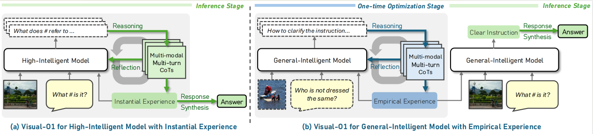
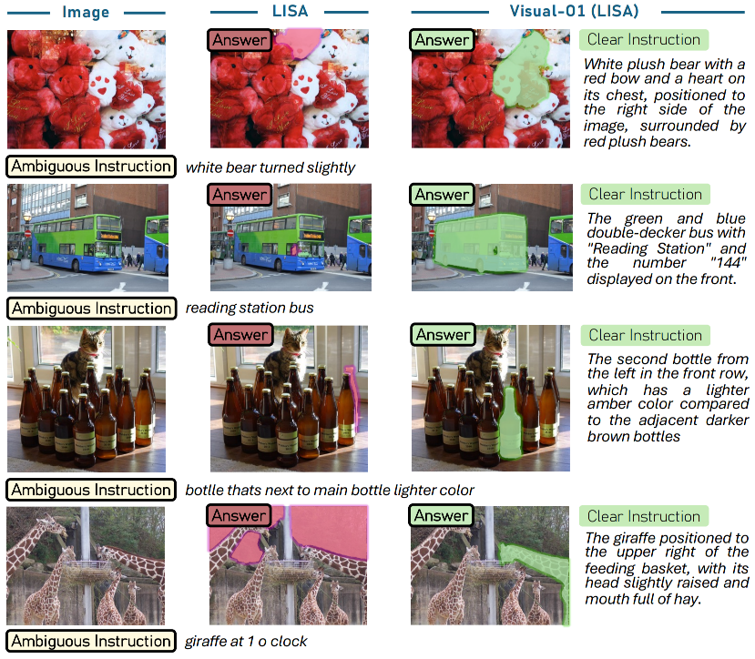

# Visual-O1: Understanding Ambiguous Instructions via Multi-modal Multi-turn Chain-of-thoughts Reasoning


Official implementation of "Visual-O1: Understanding Ambiguous Instructions via Multi-modal Multi-turn Chain-of-thoughts Reasoning".

[](https://arxiv.org/abs/2410.03321)


## Update

- [24/02/25] We released the code on Github.
- [23/01/25] Our paper is accepted by ICLR 2025.

## Overview of Visual-O1



Visual-O1 introduces multi-modal multi-turn chain-of-thoughts to understand ambiguity with (a) instantial experience for high-intelligent models to generate the correct answer directly, and (b) empirical experience for general-intelligent models to transform ambiguous instructions into clear instructions and then generate the correct answer. Instantial and empirical experience develops during inference and one-time optimization stage.

## Example

<div align="center">



</div>


## Install and Preparation

To run the code, please configure the environment using the following script.

```
conda env create -f environment.yaml
conda activate visualo1

cd ops && sh make.sh && cd ..

conda install -c conda-forge mpi4py -y
```

Then, please download the checkpoints for segmentation.

```
sh ./download_ckpt.sh
```

Finally, please manually configure the API key and endpoint. We recommend using Azure OpenAI Service, as it allows for the manual disabling of filters.

## Running

```
python main.py --data_name ambiguous_ris.jsonl --mode instantial
```

## Dataset

Please download our dataset via this [link](https://drive.google.com/file/d/10ddWiItRj3AqmV5KzDxB5aefbPmIfbTz/view?usp=sharing).

## Citation

If you find this work useful for your research and applications, please cite using this BibTeX:

```
@inproceedings{ni2025visual,
  title={Visual-O1: Understanding Ambiguous Instructions via Multi-modal Multi-turn Chain-of-thoughts Reasoning},
  author={Ni, Minheng, Fan, Yutao, Zhang, Lei and Zuo, Wangmeng},
  booktitle={The International Conference on Learning Representations},
  year={2025}
}
```
